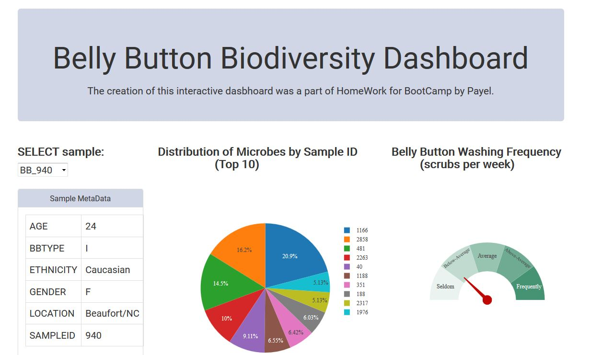
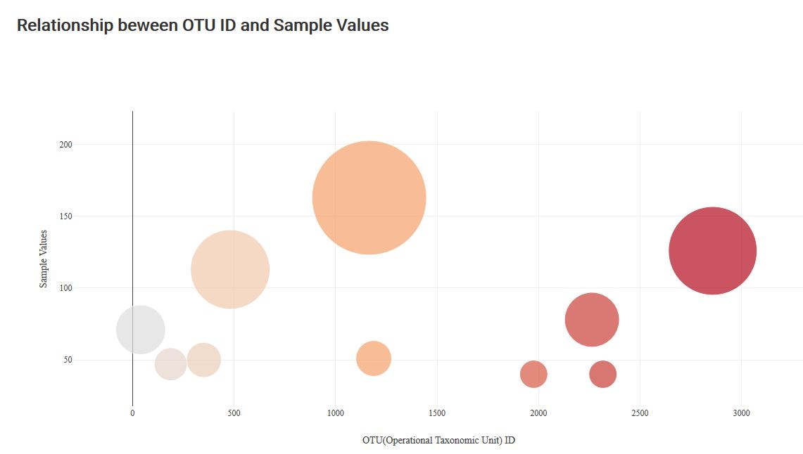

## Belly Button Biodiversity Interactive Dashboard 
##### Full-Stack Data Analytics Web Application

The creation of this interactive dashboard was created a part of homework for the BootCamp course.
 
The application is deployed on Heroku at the following link https://payelbellybotns.herokuapp.com/.

#### Key features
* Interactive dashboard based on Plotly.js

#### Technology stack used:

* Sqlite
* Pandas
* Flask microframework
* SQLAlchemy(Python SQL toolkit and Object Relational Mapper)
* Javascript
* Plotly.js(Visualization)
* HTML/CSS/Bootstrap
* Heroku

#### User Interface

